  

 

### 💻 System Logs // Overview
I am an AI Architect and Machine Learning Engineer focused on bridging the gap between raw data and autonomous execution. I specialize in deep learning evaluation, developing robust RAG pipelines, and deploying agentic workflows. 

I operate heavily in the GenAI space, utilizing open-source models and AI-assisted development environments to accelerate project lifecycles. Currently seeking US-based roles where I can architect high-performance ML systems and push the boundaries of applied artificial intelligence.

---

### ⚙️ Architecture & Tooling

- **Deep Learning Frameworks:** PyTorch, TensorFlow, Scikit-learn
- **Generative AI & LLMs:** RAG Architectures, Autonomous Agents, Prompt Engineering
- **Computer Vision:** Multi-Object Tracking (MOT), Inference Evaluation
- **MLOps & Infrastructure:** Python, MLflow, High-Compute Cloud GPU Workflows
- **Development Environments:** Claude Code, Antigravity IDE

---

### 🚀 Active Deployments

* **System-Level AI Assistant:** Developing a persistent, voice-activated AI assistant integrated directly into macOS, prioritizing open-source models for secure, localized task execution.
* **Computer Vision / MOT Evaluation:** Managing robust deep learning evaluations for Multi-Object Tracking across complex datasets (MOT16), utilizing high-performance cloud GPUs.
* **Cloud-Native ML Pipelines:** Architecting seamless, high-compute model training workflows that stream massive datasets directly from cloud storage to server GPUs, bypassing local hardware bottlenecks entirely.

 

  <a href="mailto:manankoradiya.17@gmail.com">Initialize Communication (Email)</a> • <a href="https://linkedin.com/in/manan-koradiya-124055238">Access Professional Network (LinkedIn)</a>

